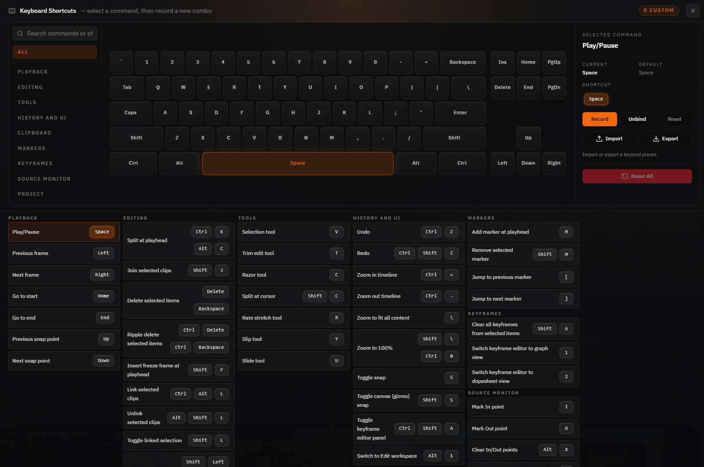

# FreeCut

**[freecut.net](http://freecut.net/)**

**在浏览器中编辑视频。**

[](LICENSE)


FreeCut 是一款基于浏览器的多轨道视频编辑器。无需安装、无需上传：项目与媒体文件均保留在本地，而剪辑、预览、分析、转写、AI 生成及导出等所有操作均在浏览器中通过 WebGPU、WebCodecs、Web Workers、OPFS 和 File System Access API 完成。

FreeCut 将项目、关联的媒体元数据、缩略图、波形图、生成的 AI 资源、转写文本、场景切分和缓存以纯文件形式写入您选择的磁盘工作区文件夹中。

## 用户指南

第一次使用 FreeCut？请从[用户指南](https://freecut.net/docs)开始。

## 截图

<table>
  <tr>
    <td width="50%">
      <strong>时间线</strong><br />
      
    </td>
    <td width="50%">
      <strong>关键帧</strong><br />
      
    </td>
  </tr>
  <tr>
    <td width="50%">
      <strong>语义化场景搜索</strong><br />
      
    </td>
    <td width="50%">
      <strong>导出</strong><br />
      
    </td>
  </tr>
  <tr>
    <td width="50%">
      <strong>音频均衡器</strong><br />
      
    </td>
    <td width="50%">
      <strong>快捷键</strong><br />
      
    </td>
  </tr>
</table>

## 功能特性

### 时间线与剪辑

- 多轨道时间线，支持视频、音频、文本、图片、形状、蒙版和复合片段
- 关联音视频剪辑，支持分割、合并、波纹编辑、滚动编辑、滑动编辑、滑移编辑和速率伸缩工具
- 以剪切为中心的转场效果，支持实时调整大小、对齐、源时间锚定和预览叠加
- 轨道静音/可见性/锁定控制、关联同步标识、轨道推拉以及闭合间隙工作流
- 胶片缩略图、立体声波形图、吸附参考线、标记点、时间码和撤销/重做
- 源监视器，支持标记入点/出点、分配目标轨道、插入编辑和覆盖编辑
- 项目模板、自动匹配首个媒体的画布尺寸/帧率，以及可自定义的键盘快捷键

### 预览与播放

- 实时预览，支持变换、裁剪、边角定位、蒙版和编组变换控件
- 通过 FreeCut 自研 `Clock` 和合成运行时实现逐帧精确播放
- 快速拖动叠加层、解码器预热、自适应预览质量和源素材预热
- 用于波纹编辑、滚动编辑、滑动编辑和滑移编辑的双画面/四画面面板
- GPU 色彩示波器：波形图、矢量示波器和直方图
- 独立项目主总线和监视器/设备音量

### 音频

- 片段音量、音频淡入淡出、轨道推子、主总线推子和立体声 LED 电平表
- 每个片段可单独进行半音/音分的音高偏移，支持 SoundTouch 预览播放
- 片段均衡器（EQ）和轨道均衡器（EQ），包含紧凑的六段浮动均衡器面板
- 音高、均衡器、淡入淡出、音量和转场音频路径在预览和导出中均能完整保留

### 特效、蒙版与合成

所有视觉特效和合成路径均以 WebGPU 为主，并在可行的情况下提供回退方案。

- **模糊：** 高斯模糊、盒状模糊、运动模糊、径向模糊、缩放模糊
- **色彩：** 亮度、对比度、曝光、色相偏移、饱和度、自然饱和度、色温/色调、色阶、曲线、色轮、灰度、怀旧、反相
- **扭曲：** 像素化、RGB 分离、旋转、波浪、凸起/凹陷、万花筒、镜像、槽纹玻璃
- **风格化：** 暗角、胶片颗粒、锐化、色调分离、发光、边缘检测、扫描线、色彩故障
- **抠像：** 色度抠像，支持容差、柔化和溢色抑制
- 25 种混合模式，包括正片叠底、滤色、叠加、柔光、差值、色相、饱和度、颜色和明度
- 片段蒙版和钢笔路径，支持可添加关键帧的几何变换

### 转场

- 淡入淡出、擦除、滑动、3D 翻转、时钟擦除和光圈转场，支持多种方向变体
- 溶解、星光、故障、漏光、像素化、色差和径向模糊
- 可调节的持续时间、对齐方式、源素材锚定，以及针对非 WebGPU 环境的 Canvas 2D 回退

### 关键帧动画

- 贝塞尔曲线编辑器、摄影表、分屏视图和多曲线叠加
- 缓动预设：线性、缓入、缓出、缓入缓出、自定义贝塞尔曲线、弹性
- 自动关键帧模式、切线镜像、属性折叠面板和框选功能
- 支持变换、裁剪、蒙版、文本、特效和色彩属性的动画化

### 媒体、AI 与分析

- 导入视频、音频、图片、GIF、SVG 和生成资源，无需复制原始文件
- 代理文件生成、缩略图提取、波形图缓存和媒体重新链接
- 基于浏览器 Whisper 的转写功能，生成带字幕的文本片段
- AI 字幕，支持本地视觉语言模型和可配置的采样频率
- 场景检测，支持直方图、光流和可选模型验证工作流
- 场景浏览器，用于搜索已转录媒体并复用检测到的精彩瞬间
- 本地 Kokoro 文字转语音旁白
- 本地 MusicGen 音乐生成，支持预设、进度显示和取消操作
- 设置中的本地模型缓存控制和卸载控制

### 项目与存储

- 通过 File System Access API 实现工作区文件夹持久化
- 多工作区切换器，支持已知工作区管理
- 项目以纯文件形式存储在磁盘上，支持旧版浏览器存储迁移
- 项目软删除、恢复、清空回收站和永久删除流程
- 项目 ZIP 打包导出/导入，采用 Zod 校验的架构
- 路径引用格式（`.freecut.json`）导出/导入，不复制媒体字节，秒级交接
- 自动保存、项目缩略图、工作区缓存镜像和孤立文件清理

#### 项目格式

| 格式 | 扩展名 | 用途 |
|------|--------|------|
| **路径引用** | `.freecut.json` | 轻量级，引用磁盘上的媒体文件。适合同机工作流（如 AI 粗剪 → FreeCut 精剪），秒级导出/导入 |
| **自包含打包** | `.freecut.zip` | 便携，打包所有媒体文件。适合跨机器分享或源文件不在本机的情况 |

**已授权文件夹：** 导入 `.freecut.json` 时，您授权的目录会持久化保存，后续导入同目录下的项目无需重复授权。可在编辑器设置中查看和撤销。

**video-use 往返工作流：** `video-use` 的 `edl_to_freecut.py --format json` 可将 AI 粗剪结果（`edl.json`）在秒内转换为 `.freecut.json`，FreeCut 直接打开即可精剪和导出，无需复制任何媒体文件。

### 导出

- 通过 WebCodecs 和 Worker 支持的渲染路径在浏览器内完成渲染
- **视频容器：** MP4、WebM、MOV、MKV
- **视频编码：** H.264、H.265、VP8、VP9、AV1、ProRes（在支持时可用）
- **音频导出格式：** MP3、AAC、WAV/PCM
- 从低到极致的质量预设，支持运行时能力检测和回退

## 快速开始

**前提条件：** 推荐 Node.js 22+、npm 11+ 以及现代 Chromium 浏览器。

```bash
git clone https://github.com/walterlow/freecut.git
cd freecut
npm install
npm run dev
```

在 Chrome、Edge、Brave 或 Arc 中打开 [http://localhost:5173](http://localhost:5173)。

### 工作流程

1. 按提示选择工作区文件夹。
2. 在项目页面创建一个项目。
3. 将文件拖入媒体库以导入媒体。
4. 将片段拖放到时间线，然后进行修剪、排列、添加特效、转场、蒙版、字幕和音频处理。
5. 根据需要使用源监视器、关键帧编辑器、场景浏览器、AI 工具和预览叠加层。
6. 直接从浏览器导出。

## 浏览器支持

推荐使用 Chrome 或 Edge 113 及以上版本。FreeCut 依赖 WebGPU、WebCodecs、OPFS 和 File System Access API，因此需要现代 Chromium 浏览器才能获得完整体验。

### Brave

Brave 可能会禁用 File System Access API。启用方法：

1. 访问 `brave://flags/#file-system-access-api`
2. 将设置从 **Disabled** 改为 **Enabled**
3. 点击 **Relaunch** 重启浏览器

## 键盘快捷键

| 操作 | 快捷键 |
|---|---|
| 播放 / 暂停 | `空格` |
| 上一帧 / 下一帧 | `←` / `→` |
| 上一个 / 下一个吸附点 | `↑` / `↓` |
| 跳转到开头 / 结尾 | `Home` / `End` |
| 在播放头处分割 | `Ctrl+K` / `Alt+C` |
| 在光标处分割 | `Shift+C` |
| 合并片段 | `Shift+J` |
| 删除选中项 | `Delete` |
| 波纹删除 | `Ctrl+Delete` |
| 定格帧 | `Shift+F` |
| 微调项目（1px / 10px） | `Shift+方向键` / `Ctrl+Shift+方向键` |
| 撤销 / 重做 | `Ctrl+Z` / `Ctrl+Shift+Z` |
| 复制 / 剪切 / 粘贴 | `Ctrl+C` / `Ctrl+X` / `Ctrl+V` |
| 选择工具 | `V` |
| 剃刀工具 | `C` |
| 速率伸缩工具 | `R` |
| 滚动编辑工具 | `N` |
| 波纹编辑工具 | `B` |
| 滑移工具 | `Y` |
| 滑动工具 | `U` |
| 切换吸附 | `S` |
| 添加 / 删除标记 | `M` / `Shift+M` |
| 上一个 / 下一个标记 | `[` / `]` |
| 添加关键帧 | `A` |
| 清除关键帧 | `Shift+A` |
| 切换关键帧编辑器 | `Ctrl+Shift+A` |
| 关键帧视图：曲线 / 摄影表 / 分屏 | `1` / `2` / `3` |
| 编组 / 取消编组轨道 | `Ctrl+G` / `Ctrl+Shift+G` |
| 标记入点 / 出点 | `I` / `O` |
| 清除入点/出点 | `Alt+X` |
| 插入 / 覆盖编辑 | `,` / `.` |
| 打开场景浏览器 | `Ctrl+Shift+F` |
| 放大 / 缩小 | `Ctrl+=` / `Ctrl+-` |
| 缩放至适合 | `\` |
| 缩放至 100% | `Shift+\` |
| 保存 | `Ctrl+S` |
| 导出 | `Ctrl+Shift+E` |

## 技术栈

- [React 19](https://react.dev/) + [TypeScript](https://www.typescriptlang.org/)
- [Vite+](https://github.com/voidzero-dev/vite-plus) 用于开发、构建、代码检查、格式化、检查和测试
- [Vite](https://vite.dev/) + [@vitejs/plugin-react](https://github.com/vitejs/vite-plugin-react)
- [WebGPU](https://developer.mozilla.org/zh-CN/docs/Web/API/WebGPU_API) 用于特效、合成、转场、蒙版、示波器和 AI 加速
- [WebCodecs](https://developer.mozilla.org/zh-CN/docs/Web/API/WebCodecs_API) 用于预览和导出管线
- [File System Access API](https://developer.mozilla.org/zh-CN/docs/Web/API/File_System_API) + OPFS 用于工作区持久化和缓存
- [Zustand](https://github.com/pmndrs/zustand) + [Zundo](https://github.com/charkour/zundo) 用于状态管理和撤销/重做
- [TanStack Router](https://tanstack.com/router) 用于基于文件的类型安全路由
- [Tailwind CSS 4](https://tailwindcss.com/) + [Radix UI](https://www.radix-ui.com/) + shadcn 风格组件
- [Mediabunny](https://mediabunny.dev/) 用于媒体解码、元数据和音频编码支持
- [Transformers.js](https://huggingface.co/docs/transformers.js) 用于本地浏览器 AI 模型
- [Kokoro.js](https://www.npmjs.com/package/kokoro-js) 用于 WebGPU 文字转语音
- Web Workers 和 AudioWorklets 用于在主线程之外进行繁重的媒体处理

## 开发

大多数命令是通过 `vite-plus`（`vp`）支持的 npm 脚本。

```bash
npm run dev                 # 开发服务器，端口 5173
npm run dev:quiet           # 开发服务器，使用性能优化的环境变量
npm run dev:compare         # 同时运行开发服务器和本地性能预览
npm run build               # 生产构建
npm run build:perf          # 使用 `.env.perf` 的生产构建
npm run preview             # 预览生产构建
npm run preview:perf        # 在端口 4173 上提供生产构建
npm run perf                # 构建并提供一个类生产的性能目标

npm run lint                # 通过 Vite+ 运行 Oxlint
npm run lint:fix            # Oxlint 自动修复
npm run format              # Oxfmt 格式化
npm run format:check        # 检查 Oxfmt 格式化
npm run check               # Vite+ 检查（不包括格式化）
npm run check:fix           # Vite+ 检查并修复

npm run test                # Vite+ 测试监视模式
npm run test:run            # Vite+ 测试单次运行
npm run test:coverage       # Vite+ 覆盖率
npm run test:preview-sync   # 聚焦的预览同步测试套件
npm run test:preview-sync:stress # 重复预览同步压力测试运行器

npm run check:boundaries            # 功能边界架构检查
npm run check:deps-contracts        # 强制依赖契约适配器路由
npm run check:legacy-lib-imports    # 触发线：阻止任何 "@/lib/*" 导入（该层已移除）
npm run check:deps-wrapper-health   # 对未使用的透传依赖包装器报错
npm run check:changed-health        # 对新增的死代码、复杂度或重复代码报错
npm run check:edge-budgets          # 功能耦合预算检查
npm run report:feature-edges        # 可读的功能边界报告
npm run report:feature-edges:json   # JSON 格式功能边界报告
npm run report:deps-wrapper-health:json # JSON 格式依赖包装器健康报告
npm run verify                      # 完整本地质量门禁

npm run routes              # 重新生成 TanStack Router 路由树
npm run changelog:append    # 追加生成的更新日志数据
npm run changelog:rollup    # 将更新日志数据汇总为发布说明
```

`npm run verify` 和 pre-push 钩子都包含 `check:changed-health`。该门禁默认运行
`fallow audit --base HEAD`，仅对当前差异引入的问题报错。使用
`npm run check:changed-health -- --base <ref>` 或设置 `FALLOW_AUDIT_BASE=<ref>`
即可与其它分支或提交对比。

### 性能检查

- `npm run dev` 最适合正确性验证和迭代开发，但包含 React/Vite 开销、HMR 和调试工具。
- `npm run perf` 更适合检查实际的播放或渲染性能，因为它在本地提供生产构建。
- `npm run dev:quiet` 保留 HMR，同时隐藏编辑器调试面板。
- `npm run dev:compare` 同时启动 `http://localhost:5173` 和 `http://localhost:4173`，方便并排对比开发与类生产环境的差异。

### 环境变量

```env
VITE_SHOW_DEBUG_PANEL=true   # 在开发模式下显示调试面板
```

## 项目结构

```text
src/
|- app/                     # 应用启动、错误边界、PWA 安装提示、调试工具
|- components/              # shadcn/ui 组件和品牌资源
|- config/                  # 热键和编辑器布局配置
|- data/                    # 生成的应用数据，包括更新日志 JSON
|- features/                # 面向用户的 UI 模块
|  |- editor/                # 编辑器外壳、工具栏、面板、对话框、依赖适配器
|  |- effects/               # 特效注册和特效 UI
|  |- export/                # WebCodecs 导出管线和 Canvas 回退渲染
|  |- keyframes/             # 曲线编辑器、摄影表、动画解析器
|  |- media-library/         # 导入、元数据、代理文件、转写、字幕生成
|  |- preview/               # 节目/源监视器、叠加层、变换控件、示波器
|  |- project-bundle/        # ZIP 和 JSON 项目导入/导出
|  |- projects/              # 项目列表、模板、迁移、回收站
|  |- scene-browser/         # 字幕和场景搜索 UI
|  |- settings/              # 设置存储、热键编辑器、模型缓存控制
|  |- timeline/              # 时间线 UI、工具、存储、服务、Worker
|  \- workspace-gate/        # 工作区选择器、权限门控、工作区切换器
|- runtime/                 # 播放和渲染引擎（非面向用户的 UI）
|  |- composition-runtime/   # 合成渲染器、媒体布局、音频图、蒙版
|  \- player/                # 时钟、播放器基础组件、视频源池
|- infrastructure/          # 平台适配器：浏览器、存储、GPU、分析、音频、缩略图
|  |- analysis/              # 场景检测、字幕生成、嵌入向量、光流
|  |- audio/                 # 基于 SoundTouch 的时间伸缩
|  |- browser/               # Blob/对象 URL 和 Mediabunny 输入适配器
|  |- gpu-effects/           # WebGPU 特效管线 + 着色器定义
|  |- gpu-transitions/       # WebGPU 转场管线 + 着色器
|  |- gpu-compositor/        # WebGPU 混合模式合成器
|  |- gpu-masks/             # 蒙版合并管线 + 纹理管理器
|  |- gpu-media/             # 媒体渲染/混合管线
|  |- gpu-scopes/            # 波形图/矢量示波器/直方图渲染器
|  |- gpu-shapes/            # 形状渲染管线
|  |- gpu-text/              # 字形图集文本管线
|  |- gpu-shared/            # GPU 模块间共享的 WGSL 代码片段
|  |- storage/               # 工作区文件系统、句柄数据库、旧版 IndexedDB 迁移
|  \- thumbnails/            # GPU 驱动的缩略图生成适配器
|- routes/                  # TanStack Router 文件路由
|- shared/                  # 框架无关的基础组件 + 跨功能状态
|  |- timeline/              # 转场引擎/注册表/渲染器、默认值
|  |- projects/              # 架构迁移和规范化
|  |- state/                 # 跨功能的 Zustand 存储
|  |- marquee/               # 框选钩子 + 叠加层（成对）
|  |- ui/                    # cn 辅助函数、属性控件
|  |- logging/               # 结构化日志记录器
|  |- typography/            # 字体加载、文本样式预设
|  |- graphics/              # 形状生成器和路径辅助函数
|  \- utils/                 # Worker、颜色/曲线数学、缓动、时间辅助函数
|- test/                    # 测试设置
\- types/                   # 共享 TypeScript 类型
```

功能模块应使用其本地的 `deps/` 适配器进行跨功能导入。平台耦合代码（GPU、ML、音频、存储、浏览器）位于 `@/infrastructure/*` 中，可直接导入；没有独立的 `lib/` 层。

架构层说明：

- [src/infrastructure/README.md](src/infrastructure/README.md)
- [src/shared/README.md](src/shared/README.md)
- 各功能文件夹内的 `deps/README.md` 文件

## 新增功能：路径引用格式（`.freecut.json`）

本次更新为 FreeCut 引入了**路径引用格式**（freecut-refs/1.0），一种轻量级的项目交换格式，与原有的 `.freecut.zip` 自包含打包互补。

### 设计目标

`.freecut.json` 只携带项目的**媒体引用**（路径提示、文件大小、修改时间），而**不复制媒体字节**。当源视频已存在于本机时（例如 AI 粗剪 → FreeCut 精剪的同机工作流），可实现**秒级**项目交接，无需等待大文件打包/解包。

### 两种格式对比

| 场景 | 推荐格式 | 原因 |
|------|----------|------|
| 同机工作流（AI 粗剪 → 精剪） | `.freecut.json` | 不复制媒体，秒级导出/导入 |
| 跨机器分享、源文件不在本机 | `.freecut.zip` | 自包含，打包所有媒体字节 |

### 媒体解析（导入时的 5 步瀑布）

导入 `.freecut.json` 时，每条媒体引用按以下顺序解析，命中即停：

1. **工作区媒体库匹配** —— 按 `文件名 + 文件大小` 二元组精确匹配已有媒体，直接复用。
2. **相对路径**（`pathHints.relativeToJson`）—— 从 JSON 所在目录沿相对路径查找。
3. **绝对路径**（`pathHints.absolute`）—— 经授权根目录遍历（浏览器受限于无法获取绝对路径，此步主要为非浏览器消费方保留）。
4. **授权根目录递归扫描** —— 在已授权的目录下按 `文件名 + 文件大小` 二元组递归查找。
5. **用户手动定位** —— 兜底，弹出目录/文件选择器。

身份校验采用 `文件名 + 文件大小` 二元组。`文件大小` 是权威指纹，字节级精确；`修改时间` 不作为校验依据（仅用于调试诊断），因为文件被复制进工作区、跨机器移动或经同步客户端处理时，字节保持不变而 mtime 会被重写。

### 已授权文件夹

导入时您授予访问权限的目录会**持久化保存**，后续从同目录导入项目无需重复授权。可在「编辑器设置」中查看与撤销。这避免了反复弹出权限请求，也使 `video-use` 往返工作流更加顺畅。

### video-use 往返工作流

[`video-use`](https://github.com/) 的 `edl_to_freecut.py --format json` 可将 AI 粗剪结果（`edl.json`）在秒内转换为 `.freecut.json`：

```
video-use 粗剪  →  edl.json  →  edl_to_freecut.py --format json  →  .freecut.json  →  FreeCut 精剪/导出
```

FreeCut 直接打开 `.freecut.json` 即可进行精剪、调色和导出，**全程不复制任何媒体文件**——时间线通过 `mediaRef` 引用解析到的本地源文件。

### 导出

在编辑器工具栏选择「导出项目（.freecut.json）」，选择目标目录即可。导出对话框会在打开模态框**之前**获取目录访问权限（避免原生选择器与 Radix 模态框的焦点冲突）。可选「隐藏本地路径」选项，省略 `pathHints.absolute`，便于安全分享。

## 贡献

FreeCut 是开源项目，但暂不接受外部贡献。目前不接受 Pull Request。

- **报告 Bug：** 提交 Issue
- **建议功能：** 发起 Discussion

## 许可证

[MIT](LICENSE)
